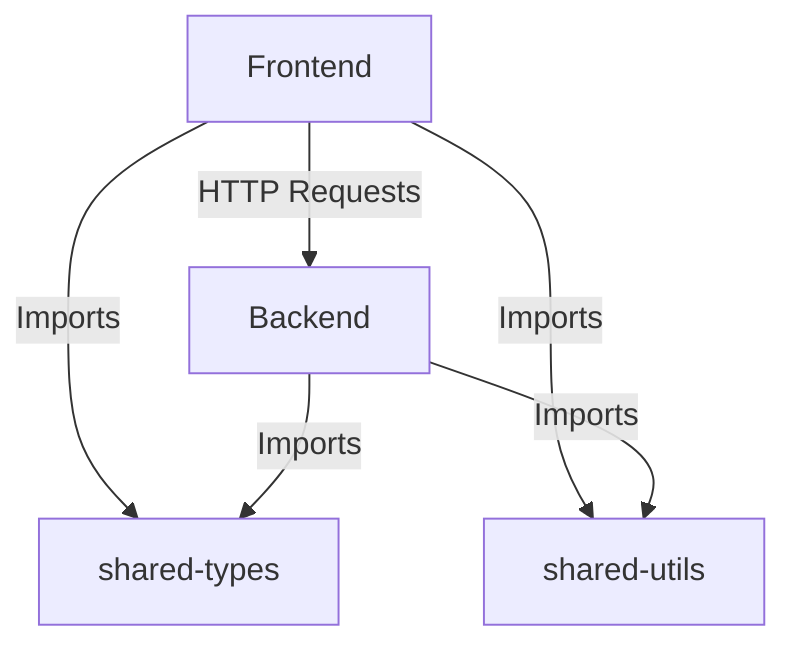

# Architecture Documentation

This document explains the structural layout, boundaries, and data flow of the LLD Case Studies monorepo project.

---

## Monorepo Layout

We use an npm workspaces monorepo structure to enforce separations between logic and presentation:

```txt
/apps
  /frontend     - Vite + React SPA. Custom typed style objects. Communicates with backend.
  /backend      - Node.js + Express API. Layered architecture.
/packages
  /shared-types - Common domain interfaces, enums, DTOs shared across apps.
  /shared-utils - Shareable helper utilities (currency, UUIDs, delayers).
/docs
  architecture.md
  object-modeling.md
  interactions.md
  pseudocode.md
  design-decisions.md
```

### Dependency Flow



---

## Layered Backend Architecture

Within `apps/backend/src/modules/<system>`, we strictly enforce a layered design to achieve the **Single Responsibility Principle** (SRP) and **Dependency Inversion Principle** (DIP):

1. **Entities / Models**:
   - Pure domain models representing core business structures and rules (e.g., `Elevator`, `ParkingSlot`, `ATM`).
   - Retain encapsulation of internal state mutations (e.g., `slot.park(vehicle)`).
2. **Interfaces**:
   - Explicit code contracts defining boundary behaviors (e.g., `ParkingStrategy`, `ElevatorScheduler`, `ATMState`, `IParkingRepository`).
3. **Services**:
   - Business use-case orchestrators (e.g., `ParkingService`, `MovieService`).
   - Tie repositories, domain logic, and strategies together without exposing DB implementation.
4. **Repositories**:
   - Data access abstraction (e.g., `InMemoryParkingRepository`).
   - Wrapped in repository interfaces, facilitating seamless database replacements (e.g., MySQL, MongoDB) in the future.
5. **Controllers**:
   - Express endpoint routing and validation handlers.
   - Maps path parameters, maps custom Domain Exceptions to proper HTTP statuses, and passes requests down.
6. **Strategies**:
   - Concrete algorithms implementing domain strategies (e.g., `LOOKScheduler`, `NearestSlotStrategy`).

---

## API Design Specifications

The application uses standard REST APIs to sync state between the React dashboard and the Node.js server.

### 1. Parking Lot System
- `GET /api/parking/floors` - Returns all floors and slot occupancies.
- `GET /api/parking/summary` - Aggregated occupancy metrics.
- `POST /api/parking/park` - Park vehicle (`licensePlate`, `vehicleType`, `slotType`).
- `POST /api/parking/exit` - Check out vehicle (`licensePlate`) and calculate charge.

### 2. Elevator System
- `GET /api/elevator/status` - Current states of the 3 elevator shafts and pendings.
- `POST /api/elevator/request` - Dispatch elevator (`floor`, `isInternal`, `elevatorId`, `direction`).
- `POST /api/elevator/tick` - Manual simulation trigger (Optional, automatic ticking active).

### 3. Movie Ticket Booking System
- `GET /api/movie/movies` - List movie catalogs.
- `GET /api/movie/shows` - Retrieve show schedules.
- `GET /api/movie/shows/:showId` - Retrieve hall seat matrices overlaying active locks.
- `POST /api/movie/lock` - Hold seat reservations (`userId`, `showId`, `seatIds`).
- `POST /api/movie/book` - Complete checkout and payments (`bookingId`, `paymentMethod`).
- `GET /api/movie/bookings/:userId` - Booking history.

### 4. ATM System
- `GET /api/atm/status` - ATM state, inventory levels, and active card/holder.
- `POST /api/atm/insert` - Insert card (`cardNumber`).
- `POST /api/atm/pin` - Authenticate card (`pin`).
- `POST /api/atm/withdraw` - Withdraw cash (`amount`).
- `POST /api/atm/deposit` - Deposit cash (`amount`).
- `GET /api/atm/balance` - Query cardholder balance.
- `POST /api/atm/eject` - Terminate session and eject card.
- `GET /api/atm/transactions` - Audit logs of ATM sessions.
