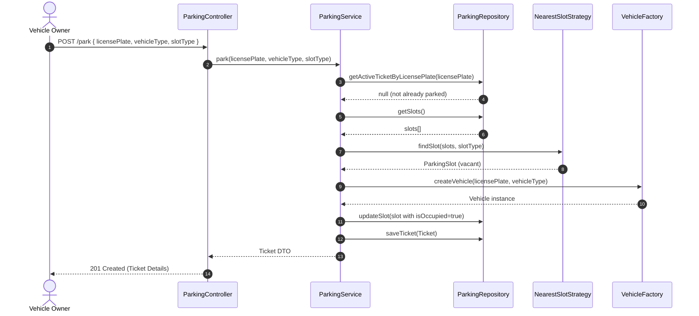
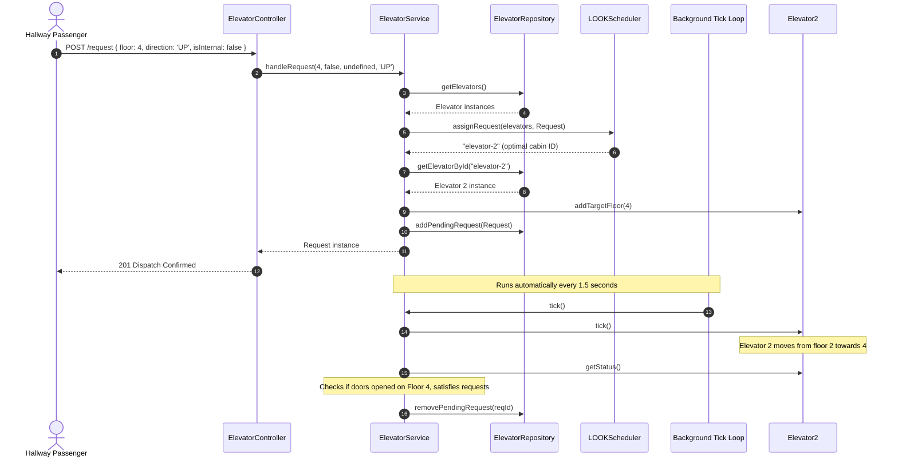
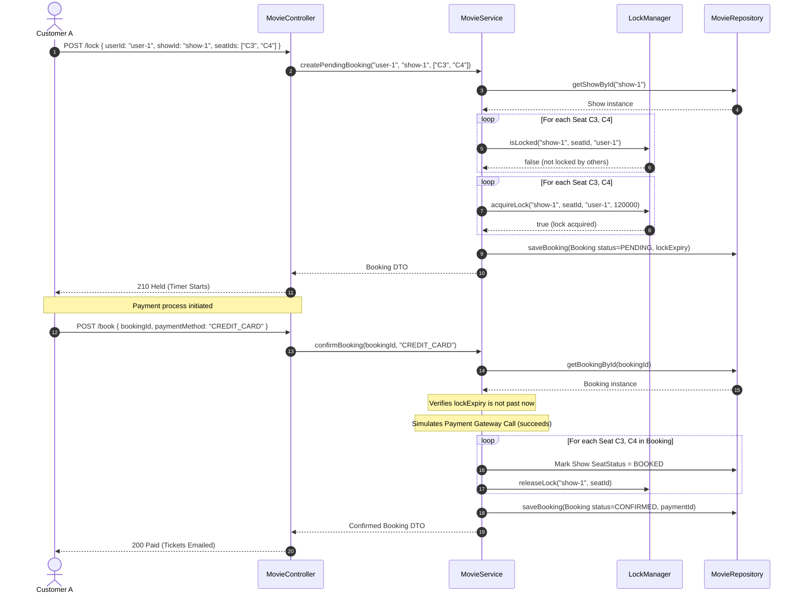
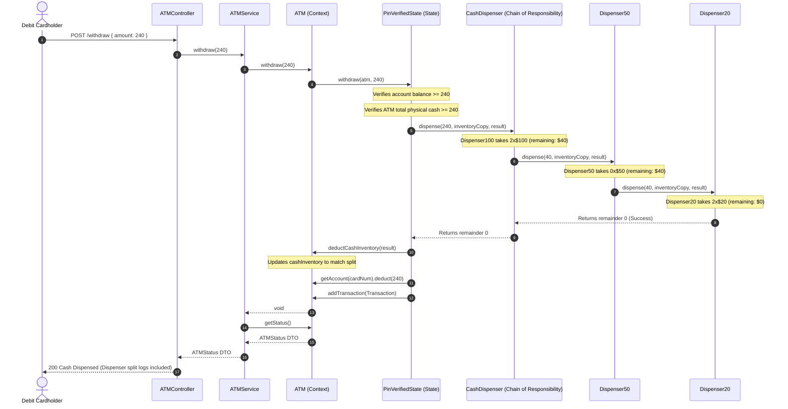

# Object Interaction & Sequence Diagrams

This document outlines the lifecycles, service communications, and interaction sequences for key flows in all four modules.

---

## 1. Parking Lot System (Entry Flow)

This sequence diagram depicts how a vehicle enters the parking lot, is assigned a slot by a strategy, and receives a ticket.

---

## 2. Elevator System (Corridor Request & Auto-Tick Movement)

This sequence demonstrates an external request dispatch and the background movement loop tick.

---

## 3. Movie Ticket Booking System (Concurrent Hold & Payment)

This sequence diagrams seat selection, temporary locks, payment processing, and final checkouts.

---

## 4. ATM System (Withdrawal Flow via State Pattern)

This sequence details card insertion, PIN checks, and Cash Dispenser Chain routing.

