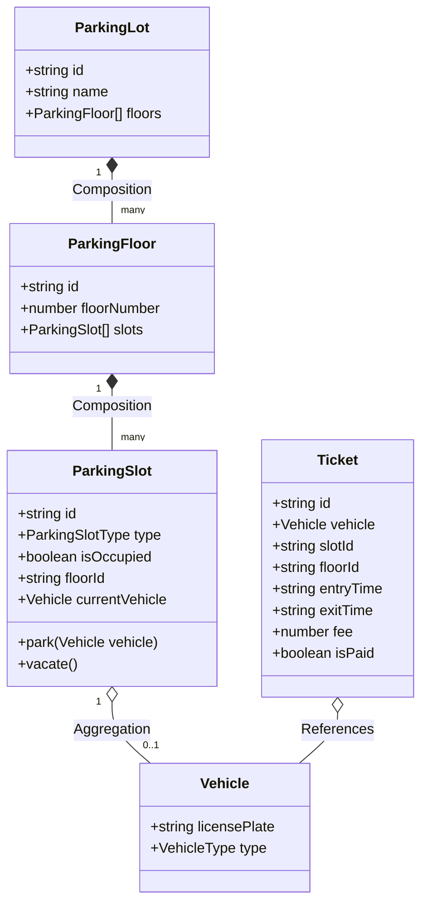
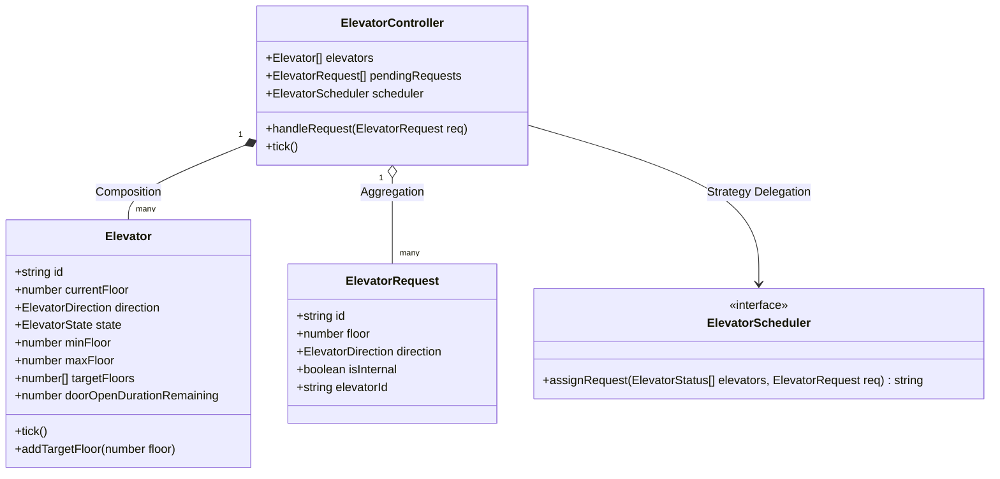
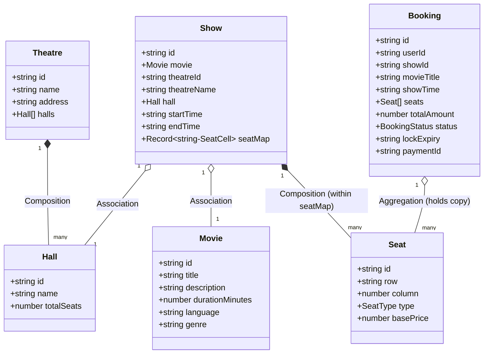
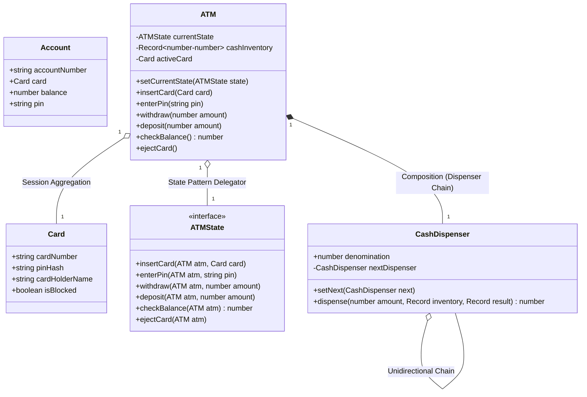

# Object Modeling Documentation

This document describes the domain entities, properties, and relationships for each of the four LLD modules, accompanied by UML class diagrams.

---

## 1. Parking Lot System

### UML Class Diagram

### Key Relationships
- **ParkingLot & ParkingFloor (Composition)**: The parking lot is composed of floors. If the parking lot is destroyed, the floors cease to exist.
- **ParkingFloor & ParkingSlot (Composition)**: Each floor manages its own slots.
- **ParkingSlot & Vehicle (Aggregation)**: A vehicle is parked in a slot. The vehicle can exist independently of the slot (when not parked).

---

## 2. Elevator System

### UML Class Diagram

### Key Relationships
- **ElevatorController & Elevator (Composition)**: The controller manages the lifetime of a fixed set of elevator cabins.
- **ElevatorController & ElevatorRequest (Aggregation)**: Requests are queued and scheduled by the controller.
- **ElevatorController & ElevatorScheduler (Strategy)**: The controller delegates dispatcher scheduling logic to a swappable `ElevatorScheduler` implementation.

---

## 3. Movie Ticket Booking System

### UML Class Diagram

### Key Relationships
- **Theatre & Hall (Composition)**: A theatre owns its screen halls.
- **Show & Movie/Hall (Association)**: A show combines a movie, a screening time, and a physical hall.
- **Booking & Seat (Aggregation)**: Bookings reference the seats reserved. The seats exist independently in the Show layout.

---

## 4. ATM System

### UML Class Diagram

### Key Relationships
- **ATM & ATMState (State Pattern)**: The ATM delegates behavior to a state interface. The ATM class behaves like a Context, and active classes (Idle, CardInserted, PinVerified, OutOfCash) execute transitions.
- **ATM & CashDispenser (Chain of Responsibility)**: The ATM references the head node of a dispenser chain. The head node delegates remaining balances to down-stream dispensers.
